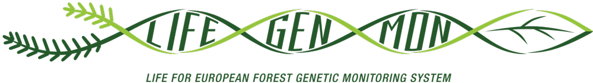

#**About**

This app was created as part of the LifeGenMon project (LIFE13 ENV/SI/000148). This project is financed by the European [LIFE](https://ec.europa.eu/easme/en/life) programme, the national ministries of Slovenia, Germany and Greece, and other project beneficiaries.

For more information on the LifeGenMon project aims and outcomes please visit the [website](http://www.lifegenmon.si/).

##**Contacts**:

**App creators** 

Phil Brailey-Jones pbraileyjones@gmail.com

Rok Damjanic rok.damjanic@gozdis.si

Natasa Sibanc natasa.sibanc@gozdis.si

**LifeGenMon Project Coordinator**

Hojka Kraigher hojka.kraigher@gozdis.si 

##**Conditions of Use**

This application is governed by the [LICENSE GLPv3]

You can use, modify and / or redistribute these codes under the terms of the GPL v3 license. This Shiny application requires the following packages:

- *list of packages*

##**LifeGenMon Partners**

##**References**

*list  of references*